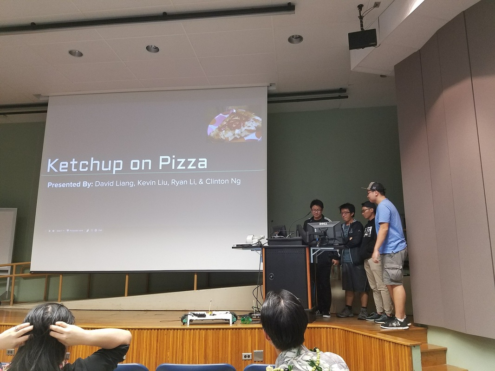
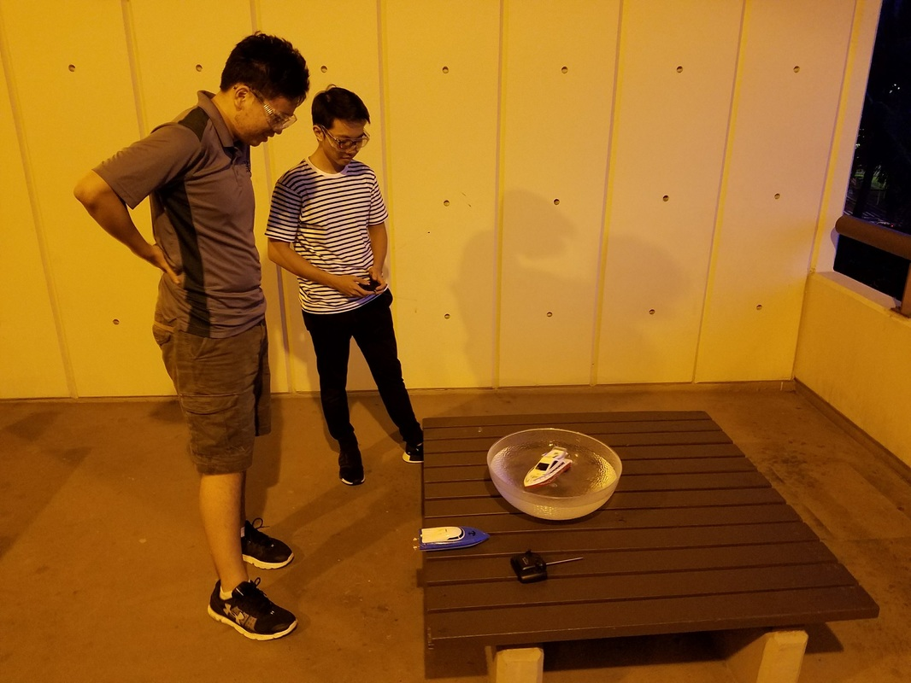
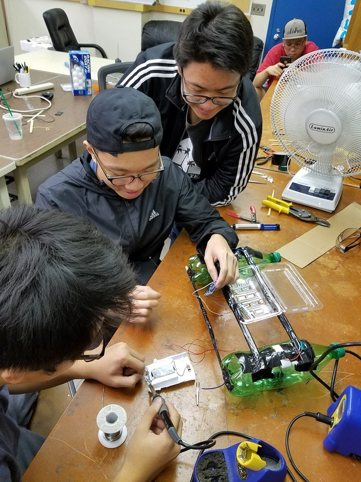
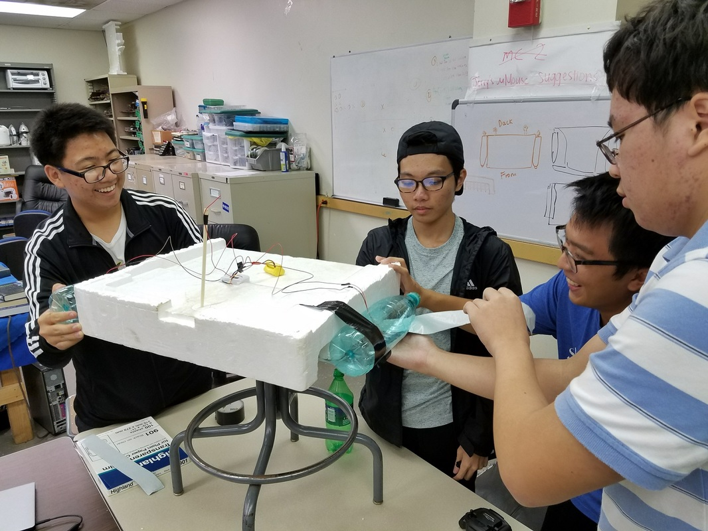
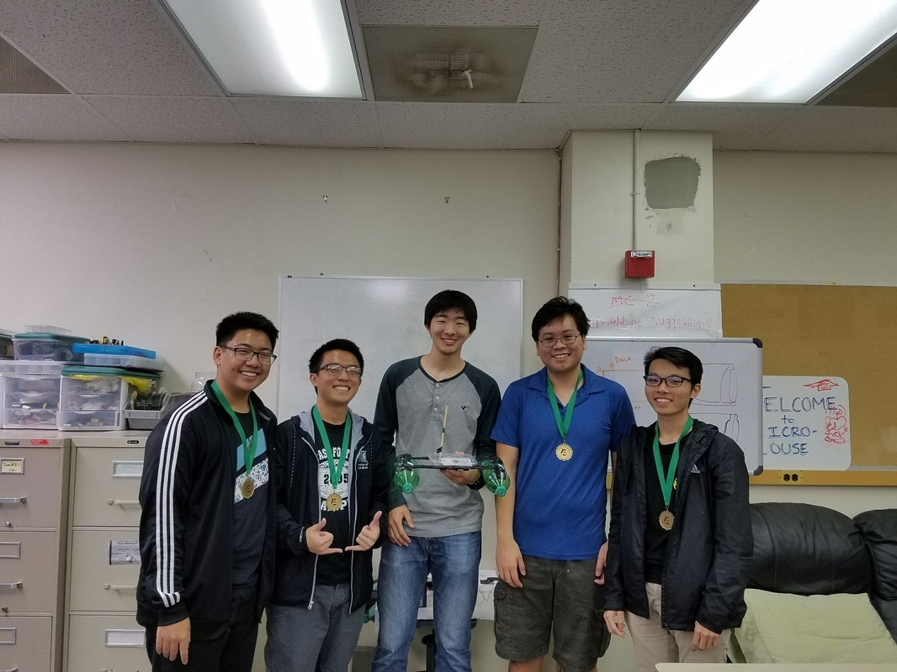

Blueprints is a program where incoming freshmen and transfer students get to participate in a semester-long engineering project while being mentored by representatives from a club. The purpose of this program is to give the new students some project experience as well as introduce them to various aspects of working on a team project. This year's challenge was to build a device that can remotely collect ping-pong balls from a pool of water. Each team was given a budget of $75 to design a working prototype. At the end of the semester, the teams presented their design and competed at the UH Manoa swimming pool.

  
  
  
  

I had the pleasure of teaming with Eta Kappa Nu, the Electrical/Computer Engineering Honor Society at the University of Hawaii. I worked alongside fellow freshmen Ryan Li, Kevin Liu, and Clinton Ng in what was my first design project in my college career. We met up roughly each week to work on the design for our vessel, and faced many challenges along the way. These challenges include broken parts, imperfect steering of our vessel, critically incorrect calculation of weight delivery and so forth. With each issue we faced, the more I learned about what it takes to develop a product with a group of like-minded individuals. 

Just a few weeks before the competition, we decided to scrap our entire design and pursue a newer, more economic one. We conducted several tests with our design which can be seen [here](https://www.youtube.com/watch?v=U0xbQglCLas&list=PL9FNoqJdsAE9q3OeDs0ISKBQSThzso5sA&index=1). At the competition, we managed to collect 29 balls in 58 seconds, which combined with our presentation scores, won us first place. You can check out the final competition video [here](https://www.youtube.com/watch?v=U0xbQglCLas&list=PL9FNoqJdsAE9q3OeDs0ISKBQSThzso5sA&index=1).

