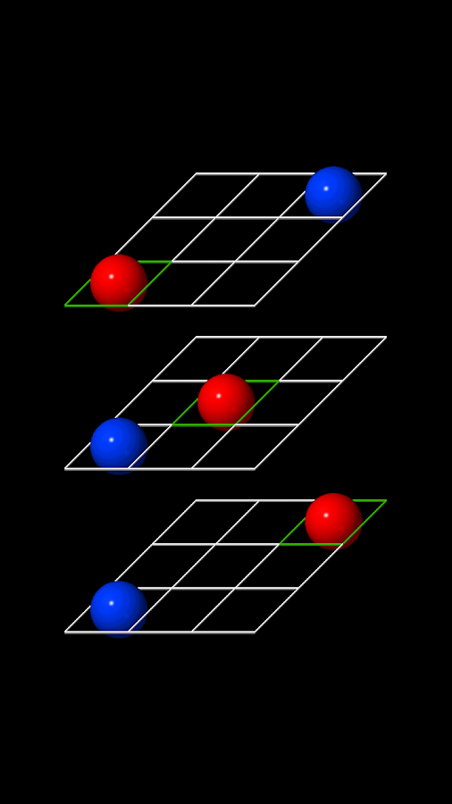

# The Idea



For our EE205 final project, we applied our knowledge of the C++ programming language to design a 3D Tic-Tac-Toe game. This game is a spinoff of traditional Tic-Tac-Toe and is played on three boards in which pieces can be connected in a seemingly three dimensional manner as seen on the image to the right. The trick with this game is that even though  

# The Implementation
We designed the game with an object-oriented approach in mind. Different classes were created for the board, game pieces, game logic, and UI. The Simple Fast Multimedia Library, traditionally called SFML, allowed us to easily apply graphics and sound to our program. I spent most of the project manipulating this library to provide mouse input, background music, and animations to our game. 


The snippet of code below shows how the pieces are originally set onto the gameboard upon startup.

```c++
Piece::Piece(float posX, float posY){
    // O Texture
    otexture.setSmooth(true);
    otexture.loadFromFile("res/images/O.png");
    // X Texture
    xtexture.setSmooth(true);
    xtexture.loadFromFile("res/images/X.png");

    for (int x = 0; x < 3; x++)
    {
        for (int y = 0; y < 3; y++)
  		{
            piece[x][y].setScale(BSCALE,BSCALE);
            piece[x][y].setTexture(otexture);

            // Change last value to 0 in order to make pieces invisible
            piece[x][y].setColor(sf::Color(255, 255, 255, 0));
            // the -2 is needed to center the Piece
            piece[x][y].setPosition(posX + (PSIZE * x) - 2, posY + (PSIZE * y) - 2);
        }
    }
}
```

You can see more at the [Github](https://github.com/jltu/Tic-Tac-Toe)


